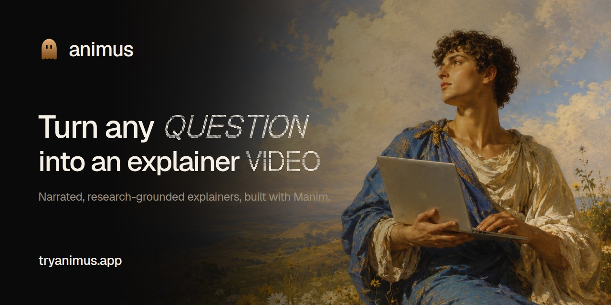

<p align="center">
  
</p>

<h1 align="center">animus</h1>

<p align="center">
  <a href="https://tryanimus.app"><strong>tryanimus.app</strong></a>
</p>

<p align="center">
  Turn any question into a narrated explainer video.
</p>

<p align="center">
  
  <a href="LICENSE"></a>
  
  
  
  
  
  <a href="CONTRIBUTING.md"></a>
</p>

<p align="center">
  
</p>

animus is an interactive coding agent for [Manim](https://www.manim.community)
videos. Think Claude Code, but in the cloud and pointed at explainer animations.

You describe a topic. The agent researches it, settles a scene plan with you,
then writes and renders Manim in a persistent cloud sandbox, reads its own
errors, and repairs until the scene is clean. Narration is synthesized during
the render, so the animation times itself to the speech instead of the other way
around.

The product is that render, diagnose, repair loop driven conversationally. Not
one shot codegen.

## What it does

**Researches before it claims.** Any specific number, date, quote or recent
event gets a web search first. A wrong fact in a finished video is treated as a
defect, not a rounding error.

**Plans with you, not at you.** The agent asks when a decision could reasonably
go two ways, then proposes an ordered scene list for you to approve or send back.
No production work starts before you agree.

**Narrates itself.** Scenes are written as `manim-voiceover` scenes against
ElevenLabs. Each beat is wrapped in its narration, so `run_time` follows
`tracker.duration` and the timing cannot drift. A music bed is mixed underneath
after the render.

**Takes any subject.** Manim is an animation engine, not a maths tool. Biology,
history, distributed systems and monetary policy are as much in scope as
calculus.

**Repairs its own work.** Render fails, agent reads the traceback, edits the
file, renders again. You watch it happen and can interrupt at any point.

**Ships somewhere.** Finished videos download as mp4 or publish to a permanent
unlisted link with a branded page and real link previews.

## How it works

Each user turn is one AI SDK tool calling loop, streamed to the browser over
SSE and abortable mid flight. Two ideas hold the design together:

- **The turn is ephemeral.** If it crashes or you stop it, you just send another
  message. Nothing durable is lost.
- **The sandbox is the state.** One [Daytona](https://www.daytona.io) sandbox per
  conversation, suspended between turns and resumed on the next message. The
  Manim project lives there across turns.

Because the project persists, a video is never a one shot artifact. Come back
three turns later and ask for a slower second act, a different colour, one more
scene: the agent edits the same files, re renders, and hands you a new cut. The
conversation and the project stay in step.

The agent gets file tools (`writeFile`, `editFile`, `readFile`, `listFiles`), a
shell (`runCommand`), a delivery tool (`renderScene`), web research through
[Exa](https://exa.ai), and two human in the loop tools that pause the loop until
you answer.

Sandboxes boot from a prebaked snapshot with Manim, ffmpeg and LaTeX already
installed, so there is no per turn cold install.

## Stack

| Layer | Choice |
| --- | --- |
| Runtime, package manager, tests | Bun, Vitest |
| Monorepo | Turborepo, source first (no per package build) |
| Web | React 19, Vite, React Router, Tailwind v4 |
| API | Hono, long running container |
| Agent | Vercel AI SDK, Claude via Amazon Bedrock, BYOK for Anthropic, OpenAI and Google |
| Sandbox | Daytona |
| Data | Postgres (Neon) with Drizzle, Cloudflare R2 for video |
| Auth | Better Auth (magic link, GitHub, Google) |
| Narration | manim-voiceover, ElevenLabs |
| Quality | Ultracite and Biome, Knip, strict TypeScript |

Costs are metered per component in integer micro USD. Bring your own model or
narration key and that half runs unmetered on your account.

## Run it locally

```bash
cp .env.example .env   # fill in what you have; the file has notes
docker compose up -d   # Postgres on :5432
bun install
cd packages/db && bun run db:migrate && cd ../..
bun run dev            # web on :5173, api on :8787
```

The API validates its env at boot, so `ELEVENLABS_API_KEY` and the four `R2_*`
vars must be present (any non empty value) even if you never render. That is a
known rough edge. `DAYTONA_API_KEY` and `EXA_API_KEY` are genuinely optional and
only resolve when a turn needs the sandbox or web research. Without
`RESEND_API_KEY`, magic links print to the API console instead of being emailed,
which is enough to sign in.

Narration needs a paid ElevenLabs tier. The free tier caps at 10k characters a
month and blocks synthesis from datacenter IPs, which is where the sandbox runs.

## Commands

```bash
bun run dev        # turbo dev (all apps)
bun run build      # turbo build (web only)
bun run typecheck  # tsc across every workspace
bun run check      # ultracite check, repo wide lint and format
bun run knip       # unused files, deps and exports
bun run test       # the test suite (not `bun test`)
```

## Layout

```
apps/
  web/    React SPA: landing, auth, studio, settings, share pages
  api/    Hono server: auth, conversations, the streaming agent loop, share endpoints
packages/
  core/   shared Zod contracts, pricing, share card and link preview builders
  agent/  the loop, prompts, Manim and sandbox tools, the bundled manim-video skill
  auth/   Better Auth
  db/     Drizzle schema, client and migrations
```

## Contributing

Contributions are welcome. [CONTRIBUTING.md](CONTRIBUTING.md) covers setup, the
four checks every change has to pass, and the conventions the codebase holds to.
[CLAUDE.md](CLAUDE.md) is the full decision record and explains why things are
the way they are.

## License

MIT. See [LICENSE](LICENSE), and [NOTICE.md](NOTICE.md) for bundled third party
assets.
